## PuntoDB : Le Jeu de Punto avec Gestion de Base de Données

### Démonstration avec Captures d'Écran

#### Lancement du Programme
Commencez par lancer le programme principal :
- Écran de démarrage : 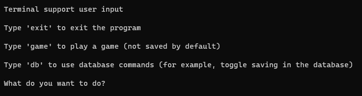

#### Sélection d'une Base de Données
Après le démarrage, choisissez une base de données pour enregistrer les parties :
- Menu de sélection de la base de données : 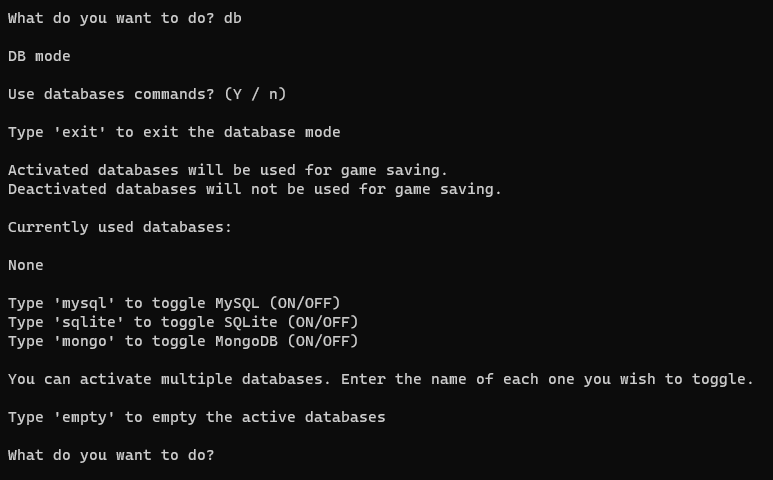
- Sélection de SQLite comme exemple : 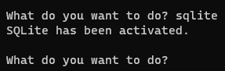

#### Quitter le Mode Base de Données
Quitter la gestion des bases de données pour commencer une partie :
- Retour au menu principal : 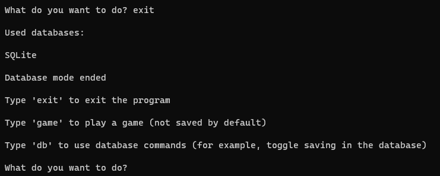

#### Démarrage d'une Partie
Lancer une partie de Punto :
- Écran de lancement d'une partie : 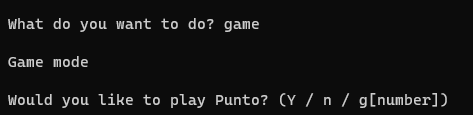

#### Jouer une Partie
Démonstration d'une partie avec deux joueurs, `NJ` et `GK`, avec `NJ` comme premier joueur :
- Début de la partie : 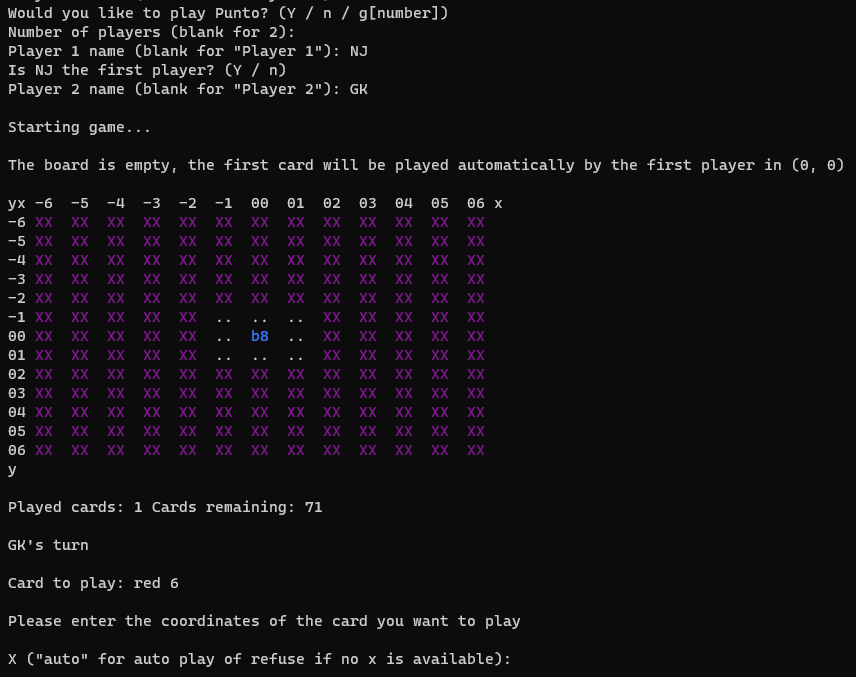
- Jouer quelques coups : 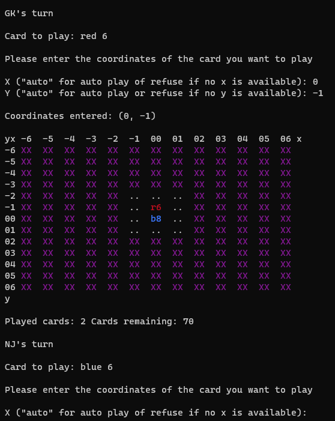
- Coup automatique : 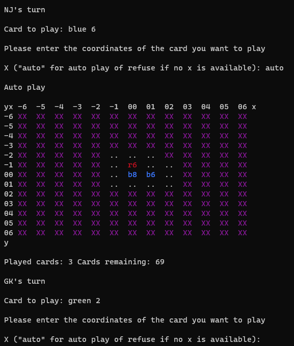
- Autres coups joués : 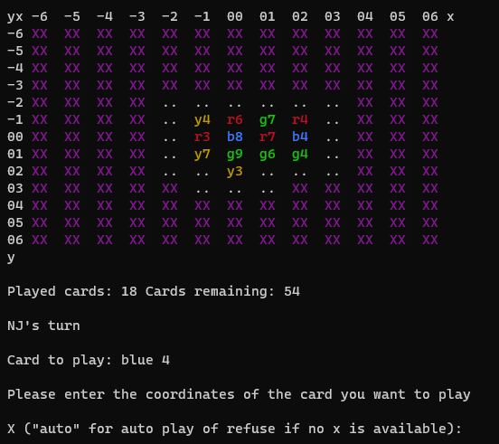

#### Quitter la Partie
Un joueur quitte la partie :
- Écran de sortie de la partie : 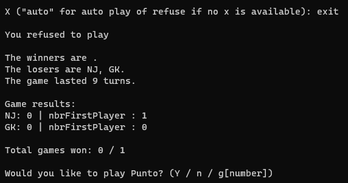

#### Vérification de la Sauvegarde
Confirmation de l'enregistrement de la partie dans la base de données :
- Vérification dans la base de données (Utilisateurs) : 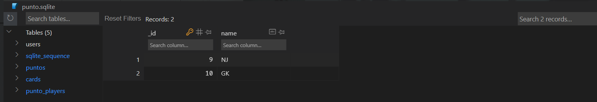
- Vérification dans la base de données (Jeu - Punto) : 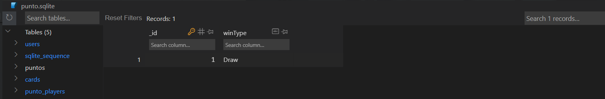
- Vérification dans la base de données (Jeu - Cartes) : 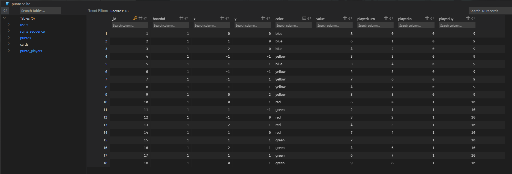
- Vérification dans la base de données (Jeu - Joueurs) : 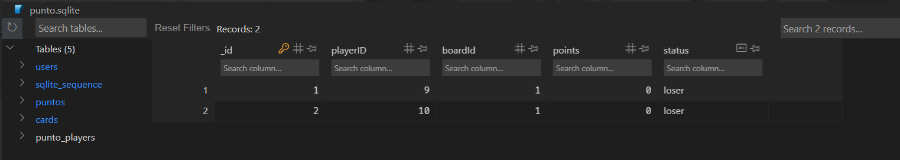

#### Vider la Base de Données et Générer des Parties
- Vidage de la base de données : 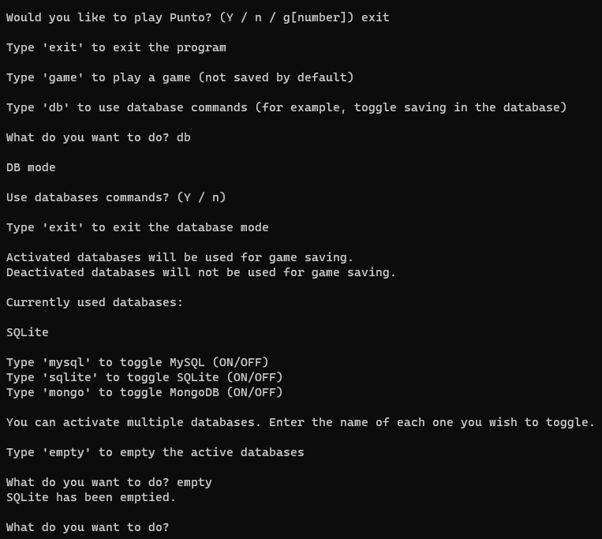
- Génération de 10 parties : 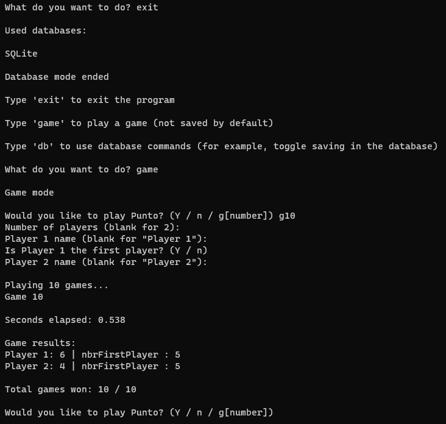

#### Vérification Finale
Confirmation des parties générées dans la base de données :
- Vérification dans la base de données après génération : 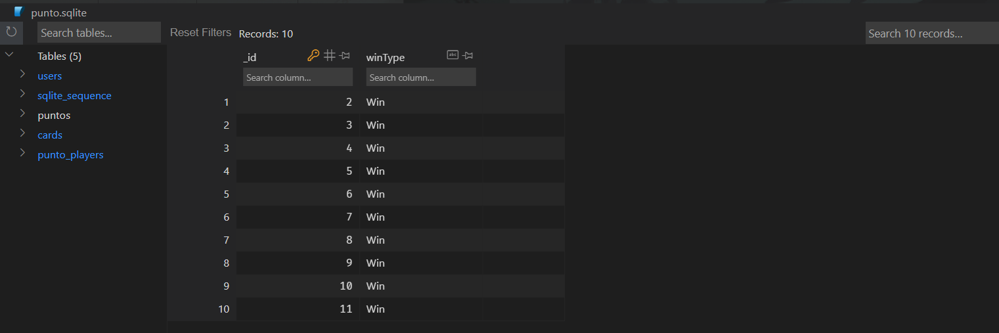