## PuntoDB : Le Jeu de Punto avec Gestion de Base de Données

### Démonstration avec Captures d'Écran

#### Lancement du Programme

Commencez par lancer le programme principal :

-   Écran de démarrage : 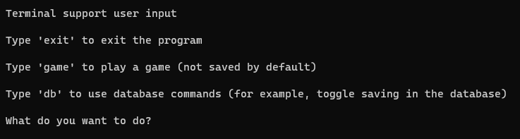

#### Sélection d'une Base de Données

Après le démarrage, choisissez une base de données pour enregistrer les parties. Pour ceci, il faut accéder au mode base de données via la commande `db`, puis sélectionner une base de données parmi les options disponibles (SQLite, MySQL, MongoDB) en tapant son nom `sqlite`, `mysql`, ou `mongo`.

-   Menu de sélection de la base de données : 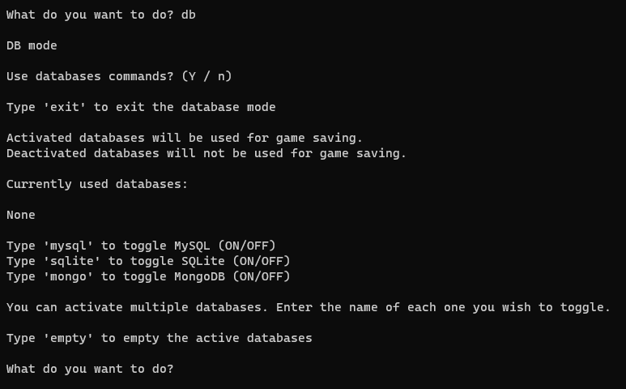
-   Sélection de SQLite comme exemple : 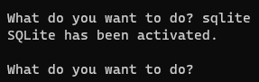

#### Quitter le Mode Base de Données

Quitter la gestion des bases de données pour commencer une partie via la commande `exit`.

-   Retour au menu principal : 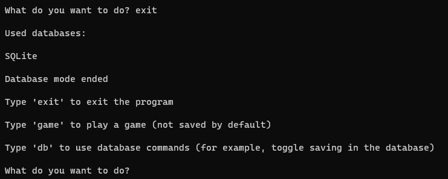

#### Démarrage d'une Partie

Lancer une partie de Punto avec la commande `game`. L'option `Y` est celle par défaut pour commencer une partie interactive. L'option `n` renvoie au menu principal et `g` permet de générer une ou plusieurs parties automatiquement (cette fonctionnalité est détaillée plus loin).

-   Écran de lancement d'une partie : 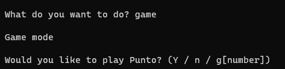

#### Jouer une Partie

Une fois la partie lancée, Le programme demande les noms des joueurs et l'ordre de jeu. Si ces informations ne sont pas fournies, des valeurs par défaut sont utilisées. Ici, les joueurs sont `NJ` et `GK`, avec `NJ` comme premier joueur.

La première carte du premier joueur est toujours posée automatiquement.

-   Début de la partie : 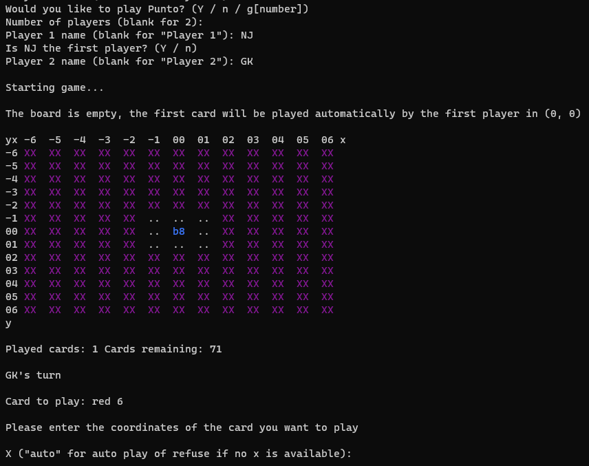

Ensuite, les joueurs peuvent jouer des coups manuellement ou laisser le programme jouer automatiquement pour eux.

Pour jouer manuellement, les joueurs doivent entrer les coordonnées de la carte à jouer (x puis y) et appuyer sur `Enter`. Il est également possible de déclarer forfait en refusant de jouer une carte si aucun emplacement valide n'est disponible.

-   Jouer quelques coups : 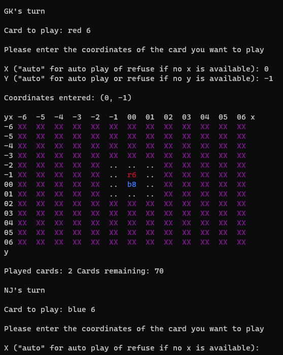
-   Coup automatique : 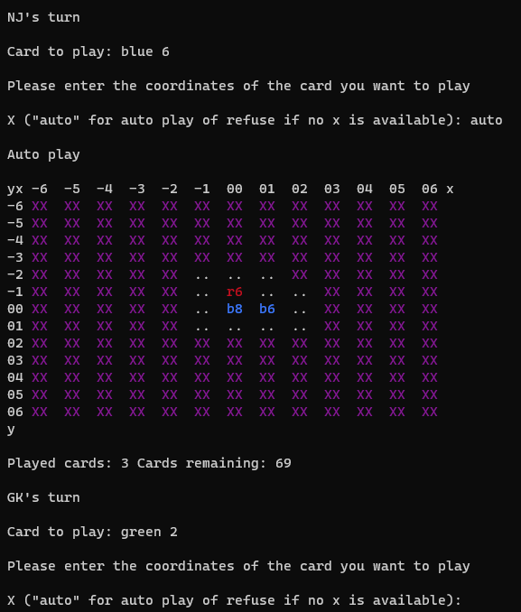
-   Autres coups joués : 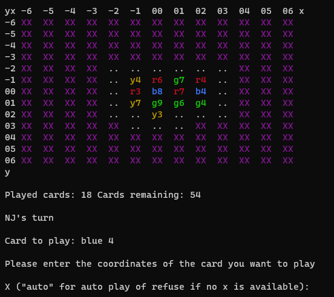

#### Quitter la Partie

Un joueur quitte la partie en rentrant `exit` au lieu d'une coordonnée de carte. Le programme confirme la sortie de la partie et affiche les scores finaux.

-   Écran de sortie de la partie : 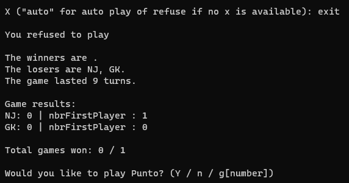

#### Vérification de la Sauvegarde

Confirmation de l'enregistrement de la partie dans la base de données :

L'image ci-dessous montre l'enregistrement correct des joueurs utilisés juste avant dans la base de données.

-   Vérification dans la base de données (Utilisateurs) : 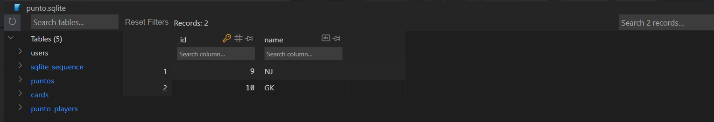

Ici nous vérifions que la partie ainsi que son résultat ont été enregistrés dans la base de données.

-   Vérification dans la base de données (Jeu - Punto) : 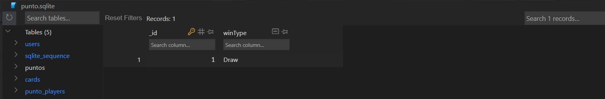

Ici il est possible de vérifier en détail les cartes jouées par chaque joueur dans la partie. Il est possible de voir leur position, leur valeur et leur couleur ainsi que le tour de jeu et le joueur associé.

-   Vérification dans la base de données (Jeu - Cartes) : 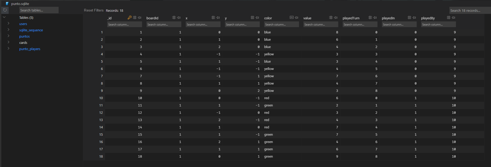

Et enfin, nous pouvons vérifier les joueurs ayant participé à la partie, leur score et leur position dans la partie.

-   Vérification dans la base de données (Jeu - Joueurs) : 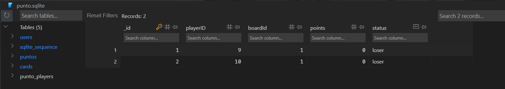

#### Vider la Base de Données et Générer des Parties

-   **Vidage de la base de données :**

    Avant de générer de nouvelles parties, il est essentiel de s'assurer que les bases de données actives sont vidées. Cette étape garantit que les nouvelles parties seront enregistrées sans interférence avec les données précédemment stockées, offrant ainsi un environnement de test ou de jeu propre.

    **Étape 1 : Vérification des bases de données actives**

    -   Avant de commencer, il est recommandé de vérifier quelles bases de données sont actuellement actives. Les bases de données qui ne sont pas activées ne seront pas affectées par le processus de vidage, ce qui pourrait entraîner des résultats inattendus si elles sont réactivées par la suite.

    **Étape 2 : Accéder au mode base de données**

    -   **Depuis le menu principal, exécutez la commande `db`** pour entrer en mode base de données. Ce mode vous permet de gérer les bases de données associées au jeu, notamment en activant/désactivant celles-ci et en vidant leur contenu.

    **Étape 3 : Vidage des bases de données**

    -   **Exécutez la commande `empty`** pour vider les bases de données actuellement actives. Cette commande supprime toutes les données existantes dans les tables pertinentes, telles que celles contenant les informations sur les joueurs, les parties, et les cartes.
    -   **Attention :** Cette action est irréversible pour les données actuelles. Assurez-vous d'avoir fait une sauvegarde si nécessaire avant de procéder.

    L'image ci-dessous illustre l'interface après l'exécution de la commande `empty`, où le terminal confirme le vidage réussi de la ou des bases de données actives.

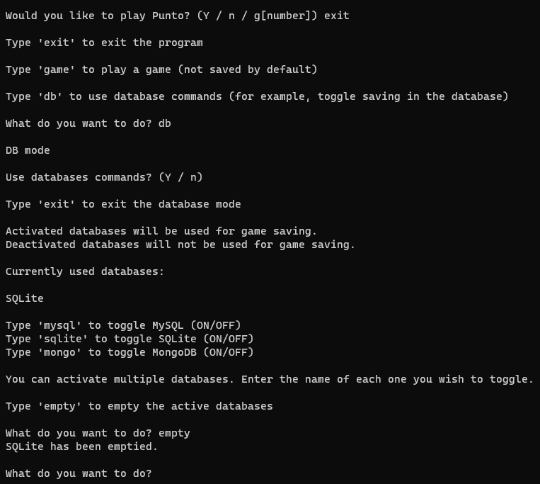

-   **Génération de 10 parties :**

    Une fois les bases de données actives confirmées, vous pouvez procéder à la génération de parties. Il est important de s'assurer qu'au moins une base de données est active avant de lancer cette opération, car les parties générées seront automatiquement sauvegardées. Si aucune base de données n'est active, les parties créées seront perdues et ne pourront pas être récupérées ensuite.

    **Étape 1 : Accéder au mode jeu**

    -   **Depuis le menu principal, exécutez la commande `game`** pour entrer en mode jeu. Ce mode vous permet de jouer une partie de Punto ou de générer plusieurs parties automatiquement.

    **Étape 2 : Générer 10 parties**

    -   **Exécutez la commande `g10`** pour générer 10 parties de manière consécutive. Le programme vous demande de configurer les paramètres des joueurs, comme leurs noms et l'ordre de jeu (si ces informations ne sont pas fournies, des valeurs par défaut seront utilisées). Une fois les paramètres définis, le programme génère les 10 parties et les enregistre automatiquement dans la ou les bases de données actives.

    **Étape 3 : Résultats**

    -   Les résultats des parties sont affichés à la fin de l'exécution, avec un résumé indiquant le nombre total de parties générées, ainsi que les scores des joueurs.

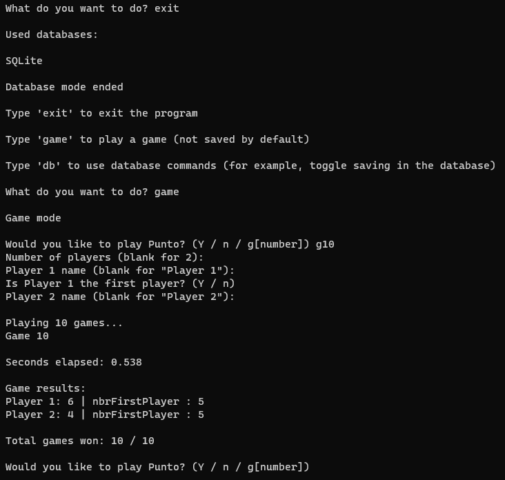

    Cette étape est utile pour les tests de performance ou pour remplir la base de données avec des données de jeu simulées, permettant ainsi d'analyser les tendances ou de vérifier la robustesse du système de sauvegarde.

#### Vérification Finale

Confirmation des parties générées dans la base de données :

-   Vérification dans la base de données après génération : 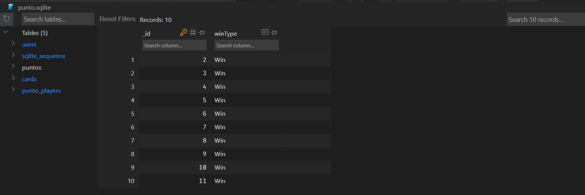
